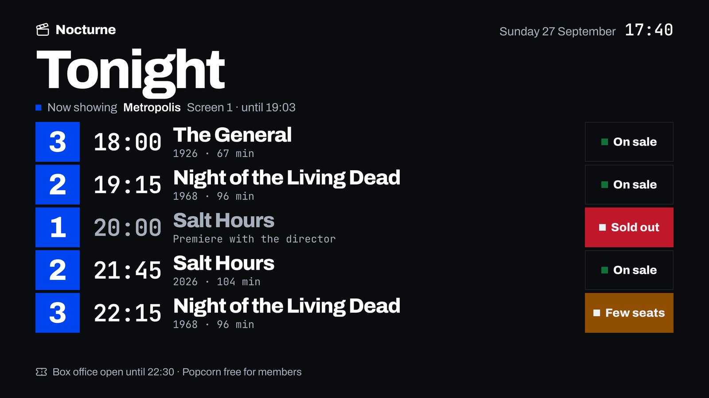

<div align="center">

# design-proposals-skill

A decision booklet for coding agents.

<a href="https://github.com/satoshi-grm"></a> <a href="LICENSE"></a> <a href="design-proposals/SKILL.md"></a>

<br><br>


</div>

<br>

Ask an agent for design proposals and you get three mockups that look the same: a purple gradient, a big number in a card, a device frame. This skill builds a decision booklet instead: 3 to 8 visual directions applied to real screens of your product, captured at real size, with a PDF, a gallery, and a `design.md` plus `tokens.css` per direction. Every direction is measured (AA contrast, no text under 12 px, nothing clipped) and the booklet closes with one recommendation.


## What is inside

- A SaaS component library in plain HTML and CSS. Every component reads tokens named like shadcn/ui, and a catalog page renders all of them in each direction's theme.
- `render.sh`, one command: local fonts, 2x captures, a 16:9 PDF, an `index.html` gallery with filters, and contact sheets for review.
- Per direction, a `tokens.css` ready for shadcn/ui and Tailwind v4, and a `design.md` your agent can build from.
- Measured checks: WCAG AA contrast per direction in light and dark mode, minimum text size (12 px, 28 px on TV), horizontal scroll and clipped text. The build exits with 1 if anything fails.
- Rules against the average AI look: no row of big numbers, no card with a colored stripe, no purple gradient, no glass, no gradient text, no cards inside cards, no device frames, no emojis.
- A worked example to copy: Nocturne, an independent cinema, in three directions and three formats.
- Generated text in English or Spanish (`"lang": "es"` in `proposal.json`).

## How it works

The example in `design-proposals/templates/example/` is Nocturne, a three-screen independent cinema.

1. **Contract.** You ask for visual proposals. The agent writes down what stays fixed (the data, the screens, the cinema's name) and what varies (color, type, shape, density, imagery, motion).
2. **Real screens.** It writes the screens the product needs, with plausible data: the programming dashboard (1440×900), the mobile ticket with a seat picker (390×844) and the lobby board for tonight (1920×1080). The same data goes into every direction.
3. **Directions.** It defines each direction in `source/proposal.json` plus one CSS file: Marquee (warm, dark, editorial serif, the photo leads), Ticket Stub (cream paper, black ink, monospaced times, dense) and Projector (cold, high contrast, solid color blocks, built for signage). Then it runs `bash design-proposals/scripts/render.sh <folder>` and looks at every capture.
4. **Decision.** You get the PDF and the gallery, a comparison, ways to mix directions, one recommendation and one question: which one, or do we mix? Once you pick, `references/handoff.md` explains how the direction moves into your repo.



## What you get

```
docs/proposals/<date>-<topic>/
├── index.html          gallery with a filter per direction
├── proposals.pdf       16:9 booklet, one screen per page
├── screens/            <direction>-<screen>.png at 2x + catalog per theme
├── <direction>/design.md   the direction's system, ready for the repo
├── <direction>/tokens.css  shadcn/ui + Tailwind v4
├── contrast.txt        WCAG pairs per direction and mode
├── limits.txt          measured text size, scroll and clipping
└── source/             everything needed to render it again
```

## Install

```bash
npx skills add satoshi-grm/design-proposals-skill
```

Or copy the `design-proposals` folder to wherever your agent reads skills, then restart the agent.

| Agent | Personal | Per project |
|:--|:--|:--|
| Codex | `~/.agents/skills/` | `.agents/skills/` |
| Claude Code | `~/.claude/skills/` | `.claude/skills/` |
| Cursor | `~/.cursor/skills/` | `.cursor/skills/` |
| Hermes Agent | `~/.hermes/skills/` | — |

```bash
git clone https://github.com/satoshi-grm/design-proposals-skill.git
cp -r design-proposals-skill/design-proposals ~/.claude/skills/
```

## Requirements

It renders on your machine. You need:

- Python 3.10 or newer, standard library only.
- Chrome or Chromium, or Playwright's `chrome-headless-shell`. To use your own binary, point `CHROME` or `SHOT_CHROME` at it.
- Optional: Pillow, so the PDF embeds JPEG instead of PNG and stays small, and for the review contact sheets.
- Optional: `poppler-utils` (`pdfinfo`, `pdftoppm`), to count pages and build the contact sheets.
- Optional: `lucide-static`, for `{i:name}` icons. Install it in the booklet folder or point `LUCIDE_DIR` at its `icons` folder.
- Network access the first time, to download the Google Fonts it keeps locally.

First run, install what you are missing:

```bash
python3 -m playwright install chromium-headless-shell   # or: npx playwright install chromium-headless-shell
python3 -m venv .venv && . .venv/bin/activate && pip install pillow
npm i lucide-static
```

<br>

<div align="center">

Made by [satoshi-grm](https://github.com/satoshi-grm) under the [MIT License](LICENSE).

</div>
