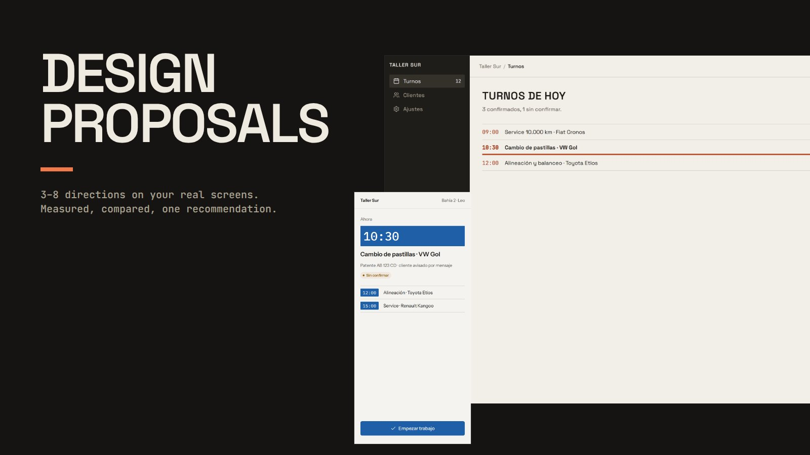
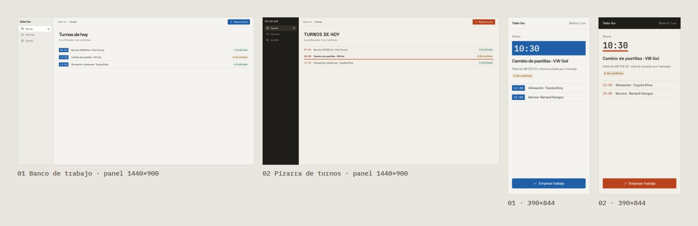

<div align="center">

# design-proposals-skill

Un cuadernillo de decisión visual para agentes de código.

<a href="https://github.com/satoshi-grm"></a> <a href="LICENSE"></a> <a href="design-proposals/SKILL.md"></a>

<br><br>



</div>

<br>

Everyone asks an agent for design proposals and gets back three generic mockups with a purple gradient. This skill builds a decision booklet instead: 3 to 8 visual directions applied to real screens of your product, captured at real size, with a PDF, a gallery, tokens and a design.md for each direction. Every direction passes measured checks (AA contrast, text at 12 px or more, nothing clipped), and the booklet ends with a firm recommendation.

Todo el mundo le pide propuestas de diseño a un agente y recibe tres maquetas genéricas con degradé violeta. Esta skill arma otra cosa: un cuadernillo de decisión con 3 a 8 direcciones visuales aplicadas a pantallas reales de tu producto, capturadas a tamaño real, con PDF, galería, tokens y un design.md por dirección. Cada dirección pasa chequeos medidos (contraste AA, texto de 12 px o más, nada recortado), y el cuadernillo cierra con una recomendación firme.



## Qué trae

- Una biblioteca de componentes SaaS en HTML y CSS, con tokens que usan los nombres de shadcn/ui y un catálogo por tema.
- `render.sh`, un solo comando: baja las fuentes a local, captura a 2x, arma el PDF 16:9, la galería `index.html` con filtro y las hojas de revisión.
- Un `tokens.css` listo para shadcn/ui y Tailwind v4, y un `design.md` por dirección.
- Chequeos medidos: contraste WCAG AA por dirección y por modo claro y oscuro, texto mínimo de 12 px (28 px en TV), scroll horizontal y recortes. Si algo no cumple, sale con 1.
- Reglas contra el diseño promedio de IA: nada de cifras grandes en fila, tarjetas con franja de color, degradé violeta, vidrio, texto con degradé, tarjetas dentro de tarjetas, marcos de dispositivo ni emojis.
- Un ejemplo mínimo para copiar: 2 direcciones, un panel de 1440×900 y un celular de 390×844.

## Cómo se usa

1. Le pedís al agente propuestas visuales para tu producto. Primero fija qué queda fijo y qué varía.
2. Escribe 3 o 4 pantallas reales del producto con datos verosímiles y define de 3 a 8 direcciones en `fuente/propuesta.json`, con un CSS por dirección.
3. Corre `bash design-proposals/scripts/render.sh <carpeta>` y revisa cada captura.
4. Te entrega el PDF y la galería con una recomendación y una sola pregunta: cuál elegís, o si mezclamos.

Cuando elegís, `references/handoff.md` explica cómo pasar la dirección a tu repo.

## Qué sale

```
docs/propuestas/<fecha>-<tema>/
├── index.html          galería con filtro por dirección
├── propuestas.pdf      cuadernillo 16:9, una pantalla por página
├── pantallas/          <dir>-<pantalla>.png a 2x + catálogo por tema
├── <dir>/design.md     sistema de la dirección, listo para el repo
├── <dir>/tokens.css    shadcn/ui + Tailwind v4
├── contraste.txt       pares WCAG por dirección y modo
├── limites.txt         texto mínimo, scroll y recortes medidos
└── fuente/             todo lo necesario para regenerar
```

## Instalar

```bash
npx skills add satoshi-grm/design-proposals-skill
```

O copiá la carpeta `design-proposals` donde tu agente lee las skills y reiniciá el agente.

| Agente | Personal | Por proyecto |
|:--|:--|:--|
| Codex | `~/.agents/skills/` | `.agents/skills/` |
| Claude Code | `~/.claude/skills/` | `.claude/skills/` |
| Cursor | `~/.cursor/skills/` | `.cursor/skills/` |
| Hermes Agent | `~/.hermes/skills/` | — |

```bash
git clone https://github.com/satoshi-grm/design-proposals-skill.git
cp -r design-proposals-skill/design-proposals ~/.claude/skills/
```

## Requisitos

Renderiza en tu máquina. Necesita:

- Python 3.10 o más nuevo, solo con la biblioteca estándar.
- Chrome o Chromium, o el `chrome-headless-shell` de Playwright. Si usás un binario propio, apuntale la variable `CHROME` o `SHOT_CHROME`.
- Opcional: Pillow, para que el PDF use JPEG en vez de PNG y pese mucho menos, y para las hojas de revisión.
- Opcional: `poppler-utils` (`pdfinfo`, `pdftoppm`), para contar páginas y armar las hojas de revisión.
- Opcional: `lucide-static`, para los íconos `{i:nombre}`. Instalalo en la carpeta del cuadernillo o apuntá `LUCIDE_DIR` a donde lo tengas.
- Red, solo la primera vez, para bajar las Google Fonts a local.

La primera vez, instalá lo que te falte:

```bash
python3 -m playwright install chromium-headless-shell   # o: npx playwright install chromium-headless-shell
python3 -m venv .venv && . .venv/bin/activate && pip install pillow
npm i lucide-static
```

<br>

<div align="center">

Hecho por [satoshi-grm](https://github.com/satoshi-grm) bajo la [licencia MIT](LICENSE).

</div>
